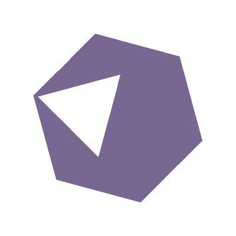

#  Hello, World!

My name is [Flavio Moreno](https://www.linkedin.com/in/flaviomoreno94/), I am a 21 yo French student learning
[Full Stack](https://www.freecodecamp.org/news/what-is-a-full-stack-developer-back-end-front-end-full-stack-engineer/), and a great lover of [Jetbrains](https://jetbrains.com/) software.   
Started Coding by age of 13 with the [java](https://www.java.com/) programming language.

I enjoy learning new things to become a better developer, always improving my code and my workflow. 
I believe in [Open-source](https://en.wikipedia.org/wiki/Open_source) and use [Ubuntu](https://ubuntu.com/download) as my
current operating system.

Know more about myself by taking a look over my [repositories](https://github.com/CustomEntity?tab=repositories) and
projects.

#

> **Languages I know, love & use**

  
  
  

  
  
  
  
  
  
 
  

  

> **Technologies, Frameworks & Tools**

  
  
  
  
  
  
  
  
  
  
  
  

  

> **My projects**

- https://valodle.eu/
- https://alldle.net/
- https://fortnitedle.net/
- https://rivalsdle.net/
- https://zeldadle.net/
- https://schedule1wiki.org/
- https://rematchtracker.com/

 

I dedicate part of my time to help beginners on community discords to find a way in this wild world of programming.

I have contributed to `52` repositories, opened `12` pull requests & `1` issues!
